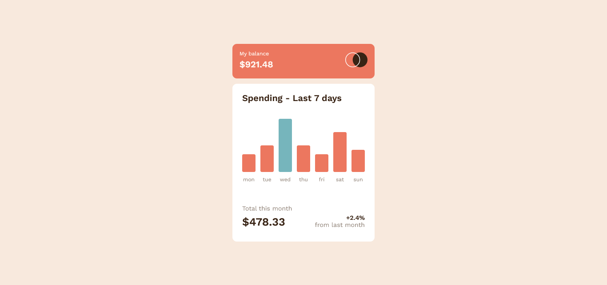

# Frontend Mentor - Expenses chart component solution

This is a solution to the [Expenses chart component challenge on Frontend Mentor](https://www.frontendmentor.io/challenges/expenses-chart-component-e7yJBUdjwt). Frontend Mentor challenges help you improve your coding skills by building realistic projects.

## Table of contents

- [Overview](#overview)
  - [The challenge](#the-challenge)
  - [Screenshot](#screenshot)
  - [Links](#links)
- [My process](#my-process)
  - [Built with](#built-with)
  - [What I learned](#what-i-learned)
  - [Continued development](#continued-development)
- [Author](#author)

## Overview

### The challenge

Users should be able to:

- View the bar chart and hover over the individual bars to see the correct amounts for each day
- See the current day’s bar highlighted in a different colour to the other bars
- View the optimal layout for the content depending on their device’s screen size
- See hover states for all interactive elements on the page
- **Bonus**: Use the JSON data file provided to dynamically size the bars on the chart

### Screenshot

### Links

- Live Site URL: [Expenses chart component](https://expenses-chart-componentproject.netlify.app)

## My process

### Built with

- Semantic HTML5 markup
- CSS custom properties
- Flexbox
- CSS Grid
- Mobile-first workflow
- Javascript

### What I learned

This is an old coded project, but here's what i learnt earlier in the past while coding it.

- I learnt how to use JSON in my javascript code and also how to parse / **("unstring")** it in other to turn a json file to an object.

- I learnt how to find the max number of an **array-object** i.e the *unstringed* json file

### Continued development

I will continue to focus on the use of json file and how to import it with **Async and Await** type programming

## Author

- Website - [CodeStan Portfolio](https://codestan.netlify.app/)
- Frontend Mentor - [@code-stan](https://www.frontendmentor.io/profile/code-stan)
- Twitter - [@Codestanley](https://www.twitter.com/codestanley)
